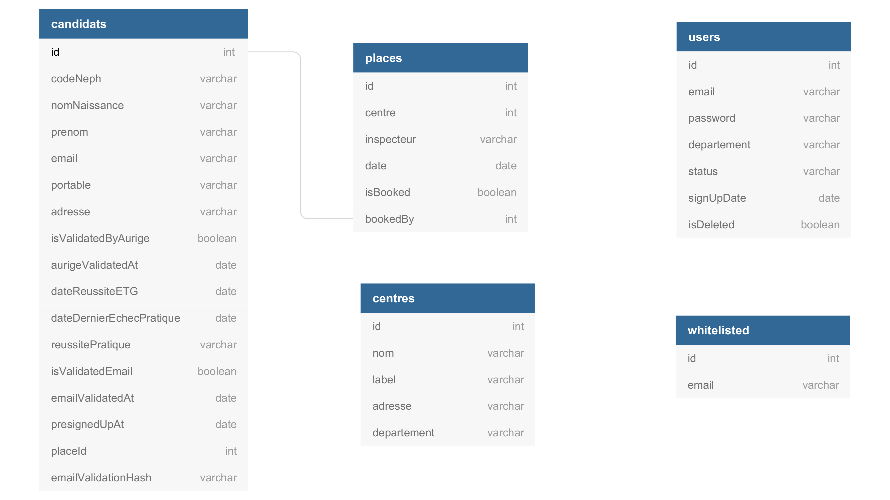
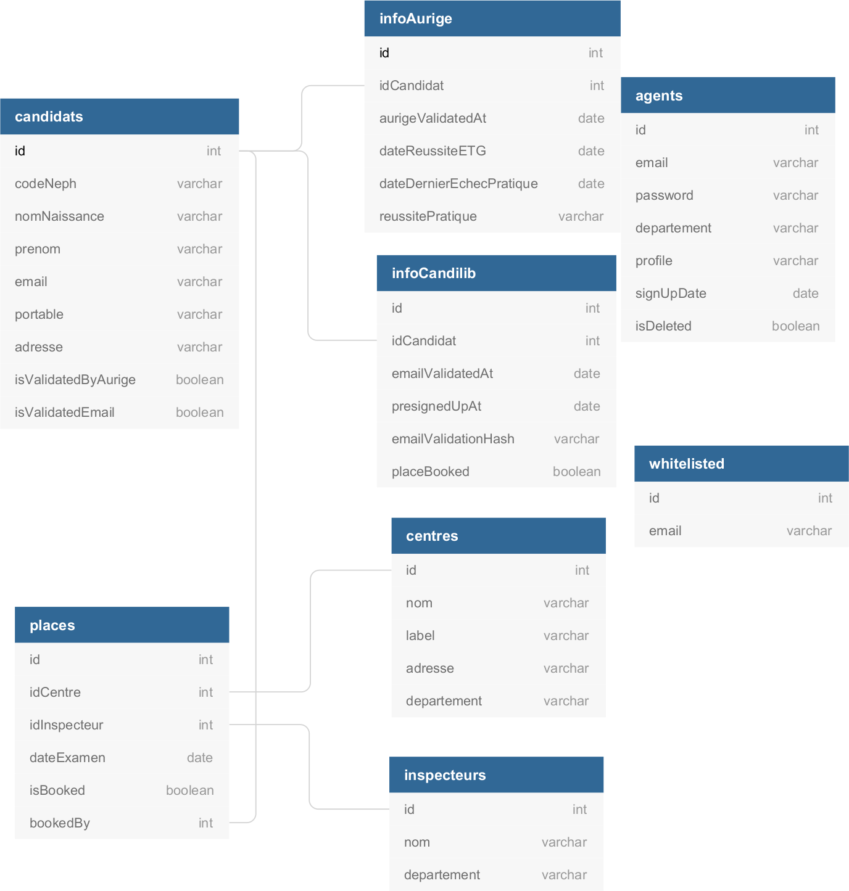

# Architecture globale

## Principes

L'application Candilib s'articule autour de 3 parties :

* ``frontal`` qui fournit les applications en fonctions des profils des utilisateurs
* ``back`` qui dispose d'un ensemble d'api utilisée par les applications web et par les composants de gestion
* ``persistance des données`` qui persiste les informations nécessaires au fonctionnement de Candilib

L'application s'adresse aux candidats et aux agents impliqués dans la gestion des examens pratiques sur l'ensemble du territoire. La partie ``frontal`` est séparée en deux parties distinctes pour chacune de ces populations. De plus, chaque composant dispose de ses propres routes vers la partie ``back`` qui assure le filtrage en fonction de l'origine des requêtes.

La partie ``back`` assure le traitement applicatif de Candilib. Elle est constituée d'un composant qui met à disposition via des API les différents services applicatifs. Ces derniers sont dédiés à un ``frontal`` et aux composants internes de gestion.

La partie ``persistance des données`` garantie :

* la disponibilité
* la fiabilité
* l'intégrité

Le schéma ci-dessous synthétise ces principes d'architecture.

## Modèle de données

Le modèle de données actuel est modélisé dans le schéma ci-dessous. Il comprend une structure `candidats` qui comporte l'ensemble des données relatives à la personne, sa situation adminitrative et son statut dans l'application candilib. Le lien entre une place d'examen et un lieu n'est pas formalisé et relève de la convention d'utiliser la même dénomination pour les champs `centre` de la structure `places` et `nom` de la structure `centres`.

Le schéma suivant est une proposition de structuration des données pour la version 2 de candilib. Elle ressort les données de la situation administrative du candidat ainsi que sa gestion au sein de l'application.

De même les données relatives aux `places` d'examen sont liées formellement avec les structures externes des `centres` et des `inspecteurs`.

La structure `utilisateurs` est renommée en `agents` et l'information de `status` est renommée en `profile`.

### Principes de cloisonnement

Dans la configuration proposée, la notion de `departement` est positionnée pour les `agents`, les `centres` et les `inspecteurs`. Cet élément permet de contrôler que seuls les agents d'un département peuvent gérer les places d'examen et les inspecteurs de leur département.

En revanche, il n'y a pas de filtrage sur les candidats qui peuvent être consultés par n'importe quel agent indépendamment d'une éventuelle réservation de place d'examen. Le lien `candidat/place` étant assuré au niveau des places d'examen, la consultation de la place réservée par un candidat ne peut se faire que par un agent en ayant la gestion. L'information `placeBooked` indique si le candidat a réservé une place d'examen. Si il existe une réservation il faut consulter les `places` en utilisant `bookedBy` avec l'`id` du candidat pour obtenir les détails.

Cette configuration permet aux agents de gérer les candidats qui pourraient changer de département pour le passage de leur épreuve pratique. Elle garantie également une confidentialité au niveau département des détails (lieu, date et inspecteur) aux seuls agents ayant en gestion ce département.

